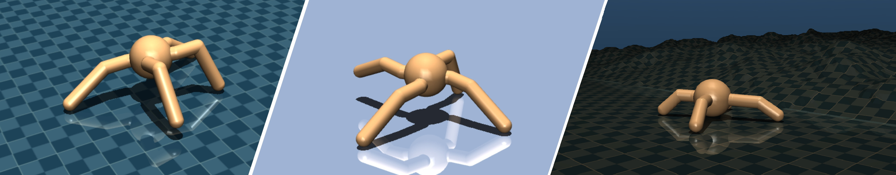
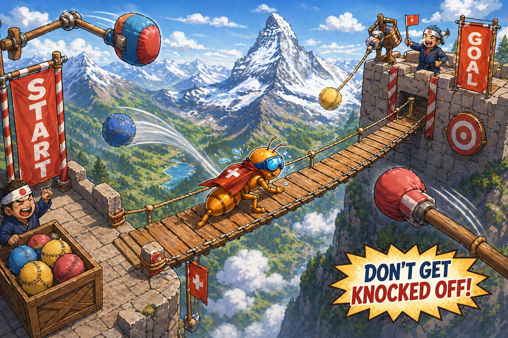

# Final Project: Multi-Task Robot Evolution

**Goal:** Evolve a single robot — body and controller — that can walk across all three training environments at once.  
**How:** Design your own evolutionary experiment using the pipeline you built in the previous challenges
 
---

<div align="center">
  
</div>

## Introduction

In the previous challenges you learned to evolve a neural controller on flat and icy terrain, and to co-evolve body and brain on a hill. The final project combines all of this into a **multi-task optimization problem**: one robot, three terrains, evaluated simultaneously.

The hypothesis is that a robot evolved to perform well on flat, icy, and hilly terrain at the same time will also generalise to an unseen evaluation terrain. The challenge is yours to define: choose a controller architecture, a body representation, an evolutionary algorithm, and analyze what emerges.

We provide a **dummy version of the evaluation terrain** so you can verify that your robot and controller are compatible with the grading script before submitting. The actual evaluation script is hidden — your robot will be tested on it during the poster session.

---

## The Default Setup

<div align="center">
  
</div>

We provide you with a skeleton for training and testing. The default setup is ready to run NSGA-II on all three training environments, using the `Challenge 3` body+controller representation. In this project you are free to change anything in the evorob pipeline. After you build your evolutionary experiment you are all set to go:

1) [`final_project_train.py`](../final_project_train.py): this is the training script from which you run your evolutionary experiment. It contains `FinalWorld` — a `World` subclass that translates a genotype into a robot body and controller, and evaluates the robot in parallel across all three terrains — and `run_multi_task_evolution`, a ready-to-run NSGA-II loop. Run it directly to start evolution:

```bash
python final_project_train.py
```

Checkpoints are saved to `results/final_project/` every `ckpt_interval` generations as `x_best.npy` and `f_best.npy`.

2) [`final_project_test.py`](../final_project_test.py): this is the testing script that checks whether your evolved robot is compatible with the grading pipeline. Point it at your results folder and it will load your robot, run it on the dummy evaluation terrain, and save a score file and video to `evaluation_output/`. <span style="color: darkred;">**If you built a custom controller, you must include its source file in the submission — without it the grading script cannot load your robot.**</span>
```bash
python final_project_test.py --best_dir_path results/final_project
```


### Genotype

The default genotype consists of two parts: a neural network and body parameters.
* The controller parameters define the neural network weights
* The body parameters define the same tree-based representation for a body in a flat array from `Introduction 0` and `Challenge 3`:

```
genotype = [ controller params (n_weights) | body params (8) ]
```

`n_weights` depends on the controller. With the default MLP (27→8→8): `n_weights = 280`, total = **288 params**. The body slice maps to 8 leg-segment lengths via `(g + 1) / 4 + 0.1`, giving lengths in `[0.1, 0.6]` m. The genotype representation itself is yours to change — see [Body representation](#body-representation) below.

### Training environments

The three training environments are the ones you already know from Challenges 1–3:

| Gym ID | Terrain | Termination | Training reward |
|--------|---------|-------------|-----------------|
| `FlatEnv-v0` | Flat, friction 1.0 | Height out of [0.2, 1.0] m | healthy + x\_velocity − costs |
| `IceEnv-v0` | Flat, friction 0.2 | Height out of [0.2, 1.0] m | healthy + x\_velocity − costs |
| `HillEnv-v0` | Procedural hill | Upside-down or stuck >10 s | healthy + x\_position − costs |


Each environment exposes `healthy_reward`, `x_position`, `ctrl_cost`, and `cfrc_cost` in its info dict. The training reward is yours to modify. The `final_project_test.py` indicates if we can successfully test your submission, and its score is not representative of the actual evaluation environment.

---

## Design your experiment

<div align="center">
  
</div>

The pipeline is intentionally modular. Every component — the evolutionary algorithm, the controller, the body representation, the reward — can be replaced independently. The four main access points are described below. You are free to change anything and to bring in external libraries.

State a **research question** and a **hypothesis** before running experiments, then design your experiment to answer it.

---

### Evolutionary algorithm

**Where:** `run_multi_task_evolution` in `final_project_train.py` — swap the `NSGAII` import for any class with an `ask` / `tell` interface.

The framework ships with several algorithms in `evorob/algorithms/`:

| File | Algorithm | Use case |
|------|-----------|----------|
| `nsga_sol.py` | NSGA-II | Multi-objective, gives a full Pareto front |
| `es.py` | Evolution Strategy | Single-objective, fast on smooth landscapes |
| `ga.py` | Genetic Algorithm | Single-objective, discrete-friendly |
| `ea_api.py` | API wrapper template | Plug in any external library |

You can also wrap external libraries via `ea_api.py` — the template is ready for CMA-ES, pyribs, evosax, or any other ask-tell framework:

```python
# Example: drop-in CMA-ES via the pycma library
# pip install cma
import cma
# Then implement ask/tell in ea_api.py using cma.CMAEvolutionStrategy
```

> **Tip:** NSGA-II returns a Pareto front — multiple trade-off solutions — which is useful for analysis. Single-objective algorithms (ES, CMA-ES) converge faster but return only one solution. You could run NSGA-II for exploration and CMA-ES to refine a chosen trade-off point.

> **Tip:** `run_multi_task_evolution` passes `fitnesses` as a `(pop, 3)` array to `ea.tell`. Single-objective algorithms expect a `(pop,)` array — reduce the three objectives to a scalar (e.g. their sum or minimum) before passing.

---

### Controller

**Where:** `FinalWorld.__init__` in `final_project_train.py` (~line 55). Any class that subclasses `evorob/world/robot/controllers/base.py` and implements `get_action`, `geno2pheno`, `get_num_params`, and `reset_controller` will work.

Available controllers in `evorob/world/robot/controllers/`:

| File | Type | Notes |
|------|------|-------|
| `mlp.py` | Feedforward MLP | Student template — implement and complete |
| `so2.py` | SO2 oscillator | Open-loop, no observations, compact genotype |
| `sinoid.py` | Sinusoidal | Open-loop, frequency per joint |
| `mlp_hebbian.py` | Hebbian MLP | Weights adapt online during episode |

You are not limited to these. The controller can be any computation that maps observations to actions — a recurrent network, a reservoir computer, a meta-learned policy, or a hand-designed gait. If it fits the `Controller` interface, it will work with the rest of the pipeline.

> **Tip:** Changing the controller changes `n_weights` and therefore the total genotype length. Print `world.n_params` at the start of training to confirm the dimensionality.

> **Tip:** An open-loop controller (SO2, sinoid) ignores the observation and produces rhythmic output purely from internal state. This typically gives a more compact genotype and faster convergence, but less adaptability to terrain perturbations.

---

### Observation space and custom sensors

**Where:** `FinalWorld.sensor_fn` in `final_project_train.py`.

By default each training environment returns the full proprioceptive state vector (joint positions + velocities, 27 values for the default ant). You can intercept and reshape this observation before it reaches the controller by setting `self.sensor_fn`:

```python
# Example — keep only joint angles and velocities (first 14 values):
self.sensor_fn = lambda obs: obs[:14]
self.controller = NeuralNetworkController(input_size=14, output_size=8, hidden_size=8)
```

The same `sensor_fn` is also stored on `EvalWorld` so that `final_project_test.py` sees the same transformed observations. Remember to set it there too, or move the logic to a shared module:

```python
# In final_project_test.py, after world = EvalWorld():
world.sensor_fn = lambda obs: obs[:14]
```

Some directions:
- **Reduce inputs** — strip redundant or noisy channels to shrink the search space.
- **Add derived features** — append joint torques, contact flags, or terrain height estimates.
- **Normalise** — scale observations to a fixed range before feeding to the controller.

> **Tip:** When you change `sensor_fn`, always update `input_size` of your controller to match the output dimension of the function.

---

### Body representation

**Where:** `FinalWorld.geno2pheno` in `final_project_train.py`. This function is entirely yours to rewrite.

The default mapping is a direct vector of 8 leg-segment lengths. Alternative representations:

- **Fewer parameters** — exploit bilateral symmetry (4 params instead of 8), or enforce equal upper/lower lengths (2 params).
- **More expressive** — add joint stiffness, leg attachment angles, or segment radii as additional body params.
- **Tree / graph encoding** — generate the robot topology from a grammar or CPPN. MuJoCo XML is built programmatically in `evorob/world/robot/morphology/ant_custom_robot.py`, so any structure that produces a valid `AntRobot` can be evolved.
- **Full body evolution** — Allow for adding/removing limbs by using different body representations (e.g., L-systems, CPPN, indirect representations).

The joint limits and axes are also editable in `FinalWorld.__init__`:

```python
self.joint_limits = [
    [-30, 30], [30, 70],   # front-left:  hip (yaw), knee (flexion)
    [-30, 30], [-70, -30], # front-right: hip (yaw), knee (flexion)
    ...
]
```

> **Tip:** The standard ant uses leg lengths of ~0.2 m upper and ~0.4 m lower. Use this as a sanity check after changing `geno2pheno`.

> **Tip:** Reducing the body parameter count makes the search space smaller, which can speed up convergence — but only if the removed degrees of freedom are genuinely redundant for your task.

---

### Reward shaping

**Where:** `step()` in `evorob/world/envs/eval_flat.py`, `eval_ice.py`, `eval_hill.py`.

Each terrain has its own environment class, so you can tune the reward independently per terrain. The cost weights are set in `__init__`:

```python
ctrl_cost_weight: float = 0.5    # penalizes large actuator torques
cfrc_cost_weight: float = 5e-4   # penalizes large contact forces
```

You can also rewrite the reward formula itself in `step()`. Some directions:
- Penalize backward movement (`x_velocity < 0`) on ice.
- Reward height gain (`xyz_after[2] - xyz_before[2]`) in addition to x-progress on the hill.
- Add a smoothness term on joint velocities to encourage energy-efficient gaits.

> **Tip:** The leaderboard uses `x_position` (total distance travelled), not `x_velocity`. Training with `x_position` in the reward (as `HillEnv-v0` already does) aligns the training signal directly with the grading metric.

---

### EA hyperparameters

**Where:** `run_multi_task_evolution` in `final_project_train.py`.

```python
run_multi_task_evolution(
    num_generations = 100,   # total EA generations
    population_size = 100,   # individuals per generation
    n_parents       = 50,    # survivors carried to next generation
    n_repeats       = 4,     # parallel episodes per individual per terrain
    n_steps         = 500,   # max timesteps per training episode
    mutation_prob   = 0.3,   # differential evolution scale factor
    crossover_prob  = 0.5,   # parameter crossover rate
    bounds          = (-1, 1),
    ckpt_interval   = 10,    # save checkpoint every N generations
)
```

<div align="center">
  
</div>

> **Tip:** `n_repeats` controls how many parallel episodes are averaged per terrain to estimate fitness. More repeats reduce noise but multiply wall-clock time linearly. Start with 2–4 for initial exploration; increase for a final convergence run.

> **Tip:** If the Pareto front collapses to a single cluster, increase `population_size` or `mutation_prob` to restore diversity.

> **Warning:** If you swap the EA, update the hyperparameter arguments to match the new algorithm. Additionally, `run_multi_task_evolution` passes `fitnesses` as a `(pop, 3)` array — single-objective algorithms expect a `(pop,)` array, so reduce the three objectives to a scalar (e.g. `fitnesses.sum(axis=1)` or `fitnesses.min(axis=1)`) before calling `ea.tell`.

---

## Analyzing your results

After evolution, analyze the Pareto front to understand the trade-offs your algorithm found.

Checkpoints store `x.npy` (full population) and `f.npy` (fitness array) per generation. Load them to plot and inspect:

```python
import numpy as np
import matplotlib.pyplot as plt

f_all = np.load("results/final_project/gen_XXX/f.npy")   # shape (pop, 3)
x_all = np.load("results/final_project/gen_XXX/x.npy")   # shape (pop, n_params)

fig = plt.figure()
ax = fig.add_subplot(111, projection="3d")
ax.scatter(f_all[:, 0], f_all[:, 1], f_all[:, 2])
ax.set_xlabel("Flat"); ax.set_ylabel("Ice"); ax.set_zlabel("Hill")
plt.show()
```

Questions to guide your analysis:

- Which individuals are flat, ice, and hill specialists? Do they have distinct body shapes or gaits?
- Is there a generalist near the centroid of the front that performs acceptably on all three?
- How does your choice of controller, body representation, or reward change the shape or spread of the front?

---

## Testing on the evaluation terrain

Once you have a best robot, test it before submitting:

```bash
python final_project_test.py --best_dir_path results/final_project
```

Pass `--best_dir_path` pointing at your results folder. If you used a non-default controller, set `MY_CONTROLLER` at the top of the script. The script saves a score file and a video to `evaluation_output/`. Set `N_EPISODES = 256` for the final submission run.

> **Note:** The score reported by `final_project_test.py` is computed on the dummy evaluation terrain and is **not** representative of the actual grading environment. Use it only to confirm that your robot and controller load and run correctly.

---

## Submission

Submit a zip named  
`2026_micro_515_SCIPER_TEAMNAME_LASTNAME1_LASTNAME2_final.zip` containing:

- `final_project_train.py` 
- `x_best.npy` — your best evolved genotype
- `<your_robot>.xml` — your best robot xml file (even if you did not change anything)
- **Your controller file** (even if you did not change anything)
- Any other file that you deem necessary for the submission to run successfully
- `README.md` (max 400 words): Specific instruction on submission folder structure, and how to run properly (if deemed necessary for the submission to run successfully) 

<div align="center">
  
</div>

---

## Questions?

Contact your teaching assistants in the exercise sessions or by e-mail:  
`fuda.vandiggelen@epfl.ch` · `alexander.ertl@epfl.ch` · `alexander.dittrich@epfl.ch` · `hongze.wang@epfl.ch`
